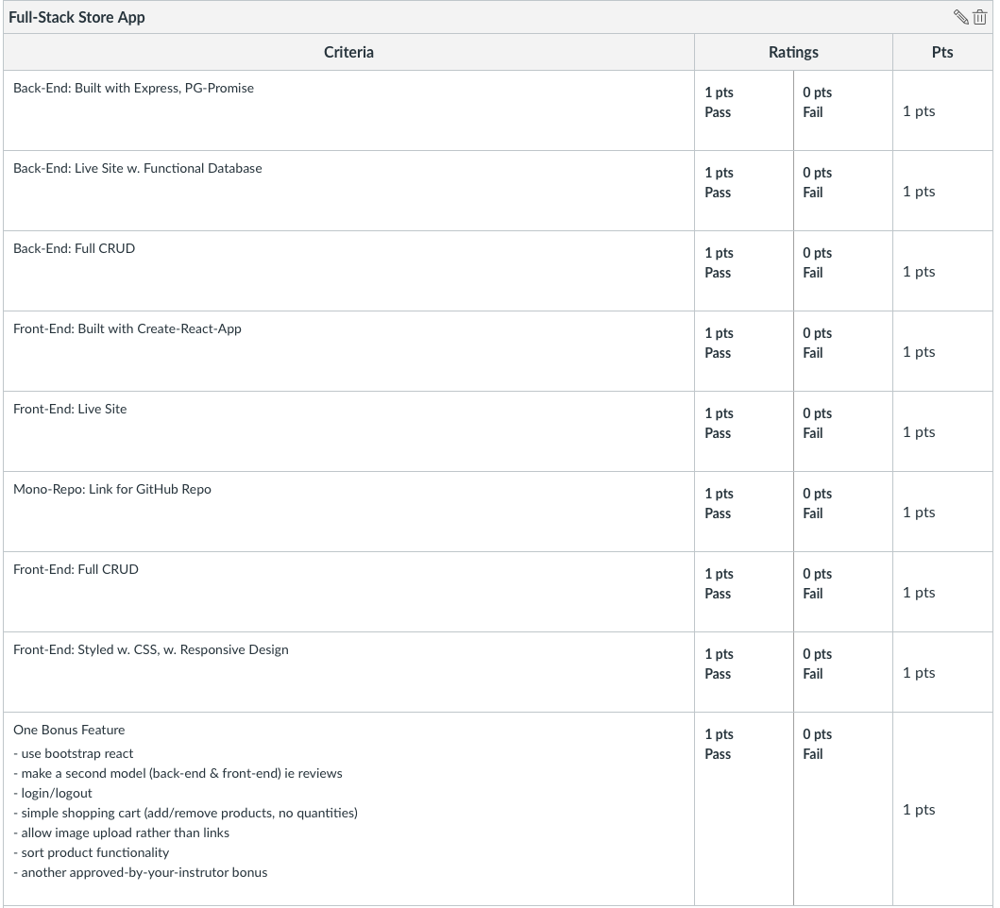

# Full Stack Store App

## Overview

- Use express & postgres/pg-promise to build a back-end
- Use create-react-app to build a front-end
- Connect the back-end and front-end
- Deploy the project online

## User Stories, Acceptance Criteria and Code Quality Rubric

You must implement all of the user stories and acceptance criteria below. After those are completed, look at and implement as many of the stretch features as you want to.

### User Stories

1. A user can see a list of products to buy
1. A user can click on the new button that takes me to a new form that lets the user create a new product
1. After clicking the submit button on the new form, it takes the user back to the index page
1. A user can click on a product and see a detailed view
1. A user can, from the detailed view, delete a product
1. A user can, from the detailed view click on an edit button and see an edit form
1. After clicking the submit button on the edit form, it will return the user back to the updated detail view
1. A user can visit this app on the internet that uses data from the express API
1. A user can share the link to the new page (once my apps are hosted online) and someone else will be able to see a specific view
1. A user can view this app on a desktop or phone and it is easy to read/use (the app has some responsive design)
1. A user can [choose one bonus below]

### Acceptance Criteria

#### Back-end

- An app that uses `express`, `dotenv`, `cors`
- The app is deployed on heroku and can be accessed from your React front-end app and Postman

Other files and folders required for full functionality of your app

|  #  | Action  |      URL      | HTTP Verb |    CRUD    |                Description                |
| :-: | :-----: | :-----------: | :-------: | :--------: | :---------------------------------------: |
|  1  |  Index  |   /products   |    GET    |  **R**ead  |   Get a list (or index) of all products   |
|  2  |  Show   | /products/:id |    GET    |  **R**ead  | Get an individual view (show one product) |
|  3  | Create  |   /products   |   POST    | **C**reate |           Create a new product            |
|  4  | Destroy | /products/:id |  DELETE   | **D**elete |             Delete a product              |
|  5  | Update  | /products/:id |    PUT    | **U**pdate |             Update a product              |

 

#### Front-End

1. Is deployed online (ie on Netlify)
1. Allows users to perform full CRUD and uses all routes built for the back-end

## Deployment

[Use this template](https://github.com/joinpursuit/pern-final-project-template) - deploy the boilerplate app as the first thing you do.

Once the apps are deployed and working as expected,

- [add your links here ](https://docs.google.com/spreadsheets/d/1LcfVPhpZS7w2x9m1wnF9MY6Sk84mGYMA-9Guu9ObW-M/edit#gid=0)

- customize the apps to be your own app.

## Bonuses - Your team MUST Implement one bonus

- Use Bootstrap React Components
- Make a second model (back-end and front-end) ie reviews
- implement login/logout (DO NOT LOCK OUT non-logged in users from being able to see the products and product details)
  - Super Bonus - admin function - only allow admins to create/edit/delete products
- create a simple shopping cart (add/remove products, front-end only)
- allow image upload rather than links
- implement sort product functionality (Front-end? Back-end? Up to you and your team to discuss pros and cons and make a choice)
- another bonus feature approved by your instructor

## Example Stores

Inspiration 1

Inspiration 2

 

 

## Canvas Rubric

